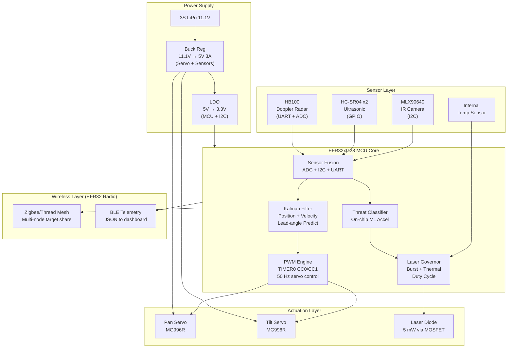
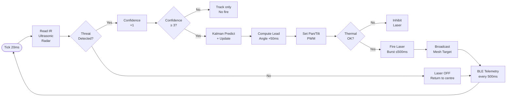
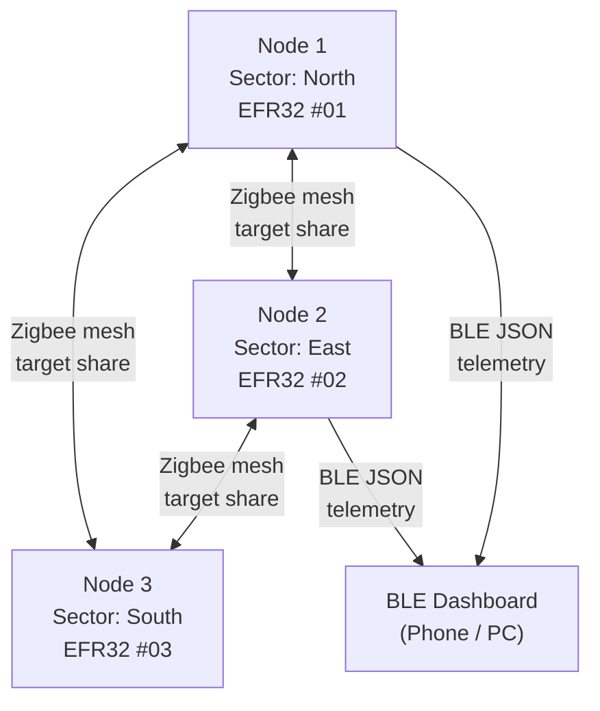

 # Laser-Based Air Defence System
   Silicon Labs — Centre of Innovation in IoT | Project Submission

Status:** Prototype in progress — documentation, architecture, and firmware complete.
> Hardware assembly underway.
1. Project Overview
Traditional missile-intercept systems such as Iron Beam rely on a single high-power laser turret that is vulnerable to adverse weather, can only engage one target at a time, and requires massive infrastructure for area coverage. This project proposes a **distributed, AI-enhanced laser air defence prototype** built on Silicon Labs EFR32xG28 that directly addresses those limitations.
What it does:-
A network of low-cost sensor-fusion nodes independently detect airborne threats (drones, UAVs, projectiles) using an IR thermal camera, Doppler radar, and ultrasonic sensors. Each node runs a Kalman filter for lead-angle prediction, drives a 2-axis servo gimbal, and fires a simulated laser (5 mW red diode). Nodes share target data over a Zigbee mesh so the swarm cooperates — if one node loses line-of-sight, a neighbour takes over tracking automatically.
Who it is for:-
Defence research students, IoT robotics enthusiasts, and developers exploring real-time embedded sensor fusion and mesh networking on Silicon Labs hardware.
Why it exists:-
To demonstrate that affordable Silicon Labs EFR32 hardware — combining on-chip wireless, hardware ML acceleration, and rich peripheral set — can implement a working proof-of-concept for cooperative autonomous tracking systems that improves on the weaknesses of full-scale directed-energy systems.

 Iron Beam Limitation                                This Prototype's Improvement 
 
 Weather blind (laser only)                          IR + ultrasonic + radar sensor fusion 
 One target per emitter                              Zigbee mesh: all nodes share target data 
 Thermal overheating pause                           Active burst governor + on-chip temp sensor 
 Needs 14 batteries for coverage                     Distributed nodes — each covers a sector 
 Reactive (no lead prediction)                       Kalman filter lead-angle targeting 
 
2. Technical Architecture
  2.1 System Block Diagram

2.2 Control Loop Flow (50 Hz / 20 ms)

2.3 Mesh Network Topology

3. Technologies Used
 Wireless--                      Zigbee (multi-node target sharing), BLE (dashboard telemetry)
 SDK/Framework--                 Gecko SDK 4.4, Simplicity Studio 5
 Programming Language--          C (embedded firmware)
 Algorithms--                    Kalman filter (position + velocity estimation), thermal centroid detection, sensor fusion (IR + ultrasonic + Doppler)
 Tools--                         Simplicity Studio 5, J-Link debugger, Python (BLE dashboard parser)
 Protocol--                      Custom binary framing with CRC8 for mesh packets; JSON over BLE UART for telemetry
  
4. Hardware Components
   Silicon Labs Hardware--
   Component                   Part                            Purpose 
    Main MCU       EFR32xG28 (BRD4400C dev kit)        Control, wireless, ML accelerator 
    Radio          EFR32 integrated 2.4 GHz                 Zigbee mesh + BLE telemetry 

External Hardware:-
Component                    Mode                        Purpose 
IR thermal camera         MLX90640 (32×24)             Heat signature detection 
Ultrasonic sensors        HC-SR04 × 2                  Distance / corroboration 
Doppler radar             HB100 (10.525 GHz)           Velocity detection, all-weather
Pan servo                 MG996R                       Horizontal gimbal axis 
Tilt servo                MG996R                       Vertical gimbal axis 
Laser diode               5 mW red 650 nm              Simulated intercept beam 
MOSFET                    IRLZ44N                      Logic-level laser switch 
Buck regulator            LM2596                       MP1584 | 11.1V → 5V 3A
LDO regulator             AMS1117-3.3                  5V → 3.3V for MCU 
Battery                   3S LiPo 2200mAh              Main power supply 
Decoupling cap            470 µF                       Servo power stabilisation

5. Working Methodology

Sensor Fusion Logic--
Three sensors vote on target presence. IR camera detects heat centroid direction. Ultrasonic confirms a physical object in range. Doppler radar confirms the object is moving at threat-relevant speed (>5 km/h). A target is confirmed only after **3 consecutive frames** of multi-sensor agreement — eliminating false positives from birds, hot pipes, or static objects.

Kalman Filter Lead-Targeting--
A 2-state (position + velocity) Kalman filter runs on each axis (pan, tilt). On each 20 ms tick it predicts the next state, then corrects with the sensor measurement. The `lead_angle()` function then projects the estimate 50 ms into the future to compensate for servo mechanical lag — the beam hits where the target will be, not where it was.

Laser Thermal Governor--
The firmware enforces: maximum 500 ms burst → mandatory 300 ms cooldown → on-chip die temperature checked before re-arm. If MCU temperature exceeds 65 °C, the laser is inhibited regardless of target state. This is the hardware-level solution to Iron Beam's overheating limitation.

Zigbee Mesh Coordination--
All nodes broadcast a compact binary target packet (CRC8 protected) to the mesh whenever they detect a valid target. Peer nodes receive this and use it as a fallback if their own sensors are obstructed. This gives the system area coverage without duplicating expensive hardware at every node.

6. Circuit Design / Proposed Implementation
Pin Assignment Table--
EFR32 Pin       Connected To           Interface 
PA0 (SDA)       MLX90640 SDA               I2C 
PA1 (SCL)       MLX90640 SCL               I2C 
PB0 (TX)        HB100 RX                  UART0 
PB1 (RX)        HB100 TX                  UART0 
PC0             HC-SR04 #1 TRIG           GPIO 
PC1             HC-SR04 #1 ECHO           GPIO 
PC2             HC-SR04 #2 TRIG           GPIO 
PC3             HC-SR04 #2 ECHO           GPIO 
PA4             HB100 IF signal           ADC0 
PD0             Pan servo PWM          TIMER0 CC0 
PD1             Tilt servo PWM         TIMER0 CC1 
PD2             Laser MOSFET gate         GPIO
PE0 (TX)        BLE/Zigbee module        UART1 
PE1 (RX)        BLE/Zigbee module        UART1 
*ECHO line is 5V logic — use a 10kΩ/20kΩ resistor voltage divider before EFR32 pin.

Power Rail Summary--
```
3S LiPo (11.1V)
    │
    ├─► LM2596 Buck Reg ──► 5V rail ──► Servos, HC-SR04, Laser via MOSFET
    │                                    (470µF decoupling cap across 5V/GND)
    │
    └─► AMS1117-3.3 LDO ──► 3.3V rail ──► EFR32 MCU, MLX90640
```
7. Software Components / Dependencies
Silicon Labs Dependencies
         Component                                   Version 
         Gecko SDK                                    4.4.0 
       Simplicity Studio                           5 (latest)
emlib (GPIO, I2C, USART, TIMER, ADC, EMU)         Included in GSDK 4.4 
       sl_sleeptimer                              Included in GSDK 4.4 
       Zigbee Pro Stack                           Included in GSDK 4.4 
       Bluetooth Stack                            Included in GSDK 4.4 

External Software Dependencies--
          Component                         Purpose 
  Python 3.x + pyserial            BLE UART dashboard parser (optional)
MLX90640 calibration constants     From EEPROM on sensor at init

Repository File Structure--

laser-air-defence-efr32/
├── README.md                        ← This file
├── laser_air_defence.slcp           ← Simplicity Studio project
├── LICENSE                          ← Apache 2.0
├── docs/
│   ├── block_diagram.md
│   └── circuit_notes.md
└── src/
    ├── main.c                       ← 50 Hz control loop
    ├── sensors.c / sensors.h        ← IR + ultrasonic + radar fusion
    ├── actuator.c / actuator.h      ← Servo PWM + laser governor
    ├── kalman.c / kalman.h          ← Kalman filter (pos + velocity)
    ├── telemetry.c / telemetry.h    ← BLE JSON + Zigbee mesh packets
    └── config.h                     ← All pin + tuning constants
    
8. Current Progress Status and Future Scope
- Full system architecture and block diagram
- All firmware modules written (sensors, actuator, Kalman filter, telemetry, mesh)
- Simplicity Studio project file configured
- Circuit design and pin mapping finalised

  #In Progress--
- Physical hardware assembly (gimbal + sensor mounting)
- MLX90640 calibration EEPROM integration
- BLE dashboard Python script

  #Future Scope--
        Feature                                                                     Description 
Edge AI threat classification          TFLite Micro model on EFM32PG28 ML accelerator — distinguish drone vs bird via IR signature 
GPS geofencing                                         Reject targets outside a defined perimeter polygon
Friend/foe tagging                         Friendly drones advertise BLE beacon with shared key — firmware skips them
Web dashboard                                   Live map of all nodes + target tracks via BLE → MQTT → browser
Multi-wavelength laser                             Combine IR + visible for all-weather intercept simulation

8. Licensing-
This project is licensed under the **Apache License 2.0.
See [LICENSE](./LICENSE) for full terms.
Third-party components:-
- Gecko SDK components: licensed under Silicon Labs MSLA
- MLX90640 driver concept: MIT (Melexis open reference)

9. Maintainers / Contacts

Name                Role              Contact                          GitHub Profile 
Nitesh Dixit     Project Lead    panditniteshdixit936@gmail.com    https://github.com/Niteshdixit936
Institution:     GLA University,Mathura,Uttar Pradesh, India
Campaign:        Centre of Innovation in IoT — Silicon Labs 2026

Submitted to the [Silicon Labs Community Creations Repository](https://github.com/SiliconLabsSoftware/community-creations) under the Centre of Innovation in IoT campaign.
